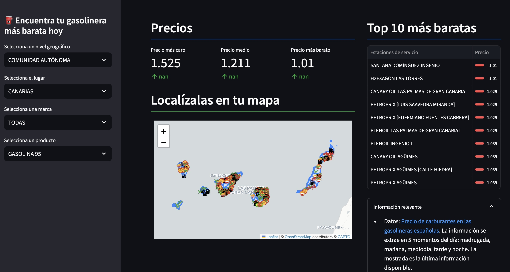

# Project: Fuel Price Extraction and Visualization in Canary Islands



This project focuses on extracting, storing, and visualizing fuel prices from service stations in the Canary Islands at various times of the day (early morning, morning, midday, afternoon, and night). The data visualization is done through an interactive Streamlit application.

## Project Structure

The project is organized into the following folders and files:

### Backend

#### 1. **`data/init`**
- **`baseline_master.csv`**: Initial file containing baseline data required for system setup.

#### 2. **`db`**
- **`creation.py`**: Script responsible for creating the SQLite database, including dimension tables (stations, dates, moments, products) and the fact table (fuel prices at specific times).
- **`models.py`**: Defines the table models using **SQLModel**, including relationships between dimensions and the fact table.

#### 3. **`scripts`**
- **`initial_bulk.py`**: Performs the initial bulk loading of dimension data into the database.
- **`daily_task.py`**: Script responsible for the daily loading of fuel prices at the five moments of the day.

#### 4. **`logs`**
- Contains log files for the various tasks in the project:
  - **`daily_task.log`**: Logs events related to daily tasks.
  - **`database_creation.log`**: Logs events during database creation.
  - **`initial_bulk.log`**: Logs events during the initial bulk data loading.

#### 5. **`utils`**
- **`logger_config.py`**: Configures the logging system to centralize and standardize project logs.

#### 6. **`.env`**
- Configuration file that stores sensitive variables or global settings.

---

### Frontend

#### 1. **`app.py`**
- Main file of the Streamlit application that organizes and defines the graphical user interface.

#### 2. **`utils.py`**
- Contains auxiliary functions to process and display information in the graphical interface.

#### 3. **`icons`**
- Folder containing service station icons (BP, CEPSA, DISA, etc.), used to visualize stations on the interactive map.

#### 4. **`municipios.geojson`**
- Geospatial file defining the locations and boundaries of municipalities in the Canary Islands, used to render interactive maps.

#### 5. **`data.py`**
- Contains information about the centroids of geographical entities and the zoom levels needed to properly center the map.

---

## Technologies and Tools Used

### Backend
- **SQLModel**: To define models and manage the database.
- **SQLite**: As the storage system.

### Frontend
- **Streamlit**: To build an interactive graphical interface.

---

## Key Features

1. **Data Extraction**:
   - Fetches fuel prices from service stations five times a day (early morning, morning, midday, afternoon, and night).

2. **Database Storage**:
   - Organizes data into a star schema:
     - Dimensions: Stations, Dates, Moments, Products.
     - Fact Table: Fuel Prices.

3. **Interactive Visualization**:
   - Displays fuel prices on an interactive map.
   - Geographically represents service stations with custom icons.
   - Allows exploration of data by municipalities and adjusts zoom levels based on locations.

---

## Setup and Installation

1. **Clone the repository**:
   ```bash
   git clone <repository-url>
   cd <repository-name>
   ```

2. **Create a virtual environment**:
   ```bash
   python -m venv venv
   source venv/bin/activate  # On Windows: venv\Scripts\activate
   ```

3. **Install dependencies**:
   ```bash
   pip install -r requirements.txt
   ```

4. **Configure the `.env` file**:
   - Create an `.env` file based on the project’s needs (e.g., path configurations or sensitive variables).

5. **Initialize the database**:
    - From backend level launch:
   ```bash
   python -m db.creation
   python -m scripts.initial_bulk
   ```

6. **Manually launch a periodic extraction**:
    - From backend level launch:
   ```bash
   python -m scripts.daily_task
   ```

6. **Run the Streamlit application**:
    - From frontend level launch:
   ```bash
   streamlit run app.py
   ```

---

## Future Enhancements

- Integrate additional data sources to enrich visualizations.
- Add advanced filters to the interface (by fuel type, price range, etc.).
- Improve scalability by migrating the database to a more robust relational system (e.g., PostgreSQL).
- Automate data extraction using a scheduler (e.g., cron or APScheduler).

